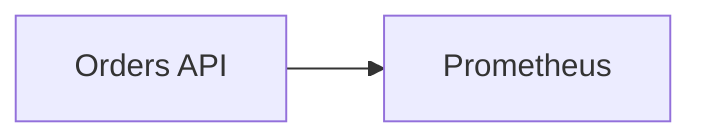

# Copilot Instructions for OpsSight Observability Lab

These instructions complement `AGENTS.md`. Follow `AGENTS.md` for repository-wide operating rules, and use this file for GitHub Copilot-specific context and review expectations.

## Repository Awareness

OpsSight is a local-first production-readiness observability lab. The core runtime is Docker Compose, with Kubernetes and Helm artifacts used for validation and migration readiness. The main services are:

- `apps/api`: FastAPI Orders API.
- `apps/dependency`: observable payment-gateway dependency.
- `apps/ai-rca`: AI-assisted RCA service with deterministic `rule_based` fallback.
- `apps/local-runtime-exporter`: local Docker/Ollama/host runtime metrics exporter.

Do not rename service-local Python packages named `app`; tests and CI intentionally run in service-specific contexts to avoid import collisions.

## Coding Conventions

- Keep Python 3.12 compatibility.
- Use Ruff-compatible formatting and import ordering.
- Keep service code small, explicit, and typed.
- Prefer existing settings, telemetry, middleware, and provider patterns over new abstractions.
- Preserve deterministic AI RCA behavior without requiring LLM access.

## Observability Requirements

Application changes should preserve or improve:

- `/health/live` and `/health/ready` readiness behavior where applicable.
- Prometheus `/metrics` output.
- structured JSON logs with correlation and trace context.
- OpenTelemetry trace export through Grafana Alloy.
- Grafana dashboard compatibility and stable metric names.

Do not change metric names, label names, alert rule names, or dashboard assumptions without updating docs and validation notes.

## CI/CD Expectations

Do not weaken existing gates. The expected validation order before PRs is:

```bash
python -m ruff check apps scripts tests
python -m ruff format --check apps scripts tests
python -m pytest tests
docker compose config --quiet
kubectl apply --dry-run=client --validate=false -f k8s/base -f k8s/api -f k8s/monitoring
bash scripts/smoke-test.sh
```

Run service-scoped tests from each service directory when touching service code:

```bash
cd apps/api && python -m pytest
cd ../ai-rca && python -m pytest
```

## Kubernetes Rules

- Keep manifests modular under `k8s/base`, `k8s/api`, and `k8s/monitoring`.
- Validate with `kubectl apply --dry-run=client --validate=false`.
- Do not claim production deployment readiness without ingress, TLS, storage classes, image publishing, and secret management.

## Mermaid Rules

GitHub-rendered Mermaid should use simple node IDs and quoted labels:



Avoid slash-heavy node labels, raw punctuation in IDs, and syntax that only works in non-GitHub renderers.

## Docker Standards

- Keep custom containers non-root.
- Keep local-only Docker socket and host filesystem mounts documented as local observability tradeoffs.
- Do not remove health checks or smoke-test expectations to make a build pass.
- Keep `.dockerignore` files aligned with build contexts.

## Security Guardrails

- Never commit secrets, API keys, tokens, real credentials, or private endpoints.
- Do not disable CodeQL, Trivy, pip-audit, secret scanning guidance, or branch-protection assumptions.
- Prefer least privilege and document local-demo exceptions clearly.
- Treat Dependabot as version governance unless repository security updates are explicitly enabled.

## PR Expectations

Every meaningful PR should explain:

- what changed
- why it changed
- validation performed
- operational impact
- security impact
- rollback or recovery notes
