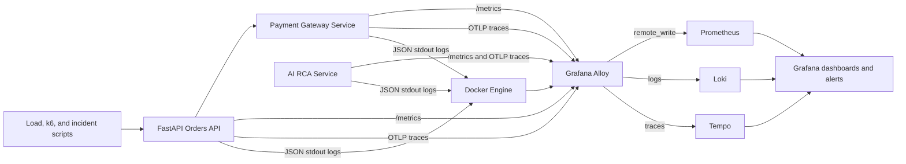

# OpsSight Observability Lab

[](https://github.com/capujm10/OpsSight-Observability-Lab/actions/workflows/ci.yml)
[](LICENSE)
[](pyproject.toml)
[](apps/api)

OpsSight Observability Lab is a fully containerized local observability and SRE platform for production-style FastAPI services. It is designed as a modern enterprise-grade observability and SRE platform inspired by real-world SaaS incident management and cloud-native operational practices.

The goal is operational realism: metrics, logs, traces, dashboards, alerts, and incident workflows all come from a real API service and real telemetry pipelines.

## Architecture



## What It Demonstrates

- FastAPI service with production-style middleware, health checks, standardized responses, and exception handling.
- A separate observable payment-gateway dependency service with metrics, logs, traces, and failure simulation.
- Prometheus metrics for request rate, duration, errors, active requests, endpoint throughput, status distribution, and dependency latency.
- Structured JSON logs with correlation IDs, trace IDs, severity, route, status code, and exception stack traces.
- OpenTelemetry traces exported to Grafana Alloy and stored in Tempo.
- Grafana dashboards for golden signals and incident investigation.
- Prometheus and Grafana alerting with severity, probable causes, and remediation guidance.
- SLO and error budget tracking for availability, latency compliance, and error rate.
- Burn-rate recording rules and fast/slow burn alerts.
- Reproducible incident scenarios for downtime, latency, 500s, dependency degradation, and partial service failure.
- Production-inspired incident management and postmortem generation from structured incident data.
- Local-first AI-assisted RCA with rule-based fallback, Ollama/LM Studio/OpenAI-compatible provider support, and postmortem enrichment.
- k6 smoke, spike, and sustained load profiles.
- Kubernetes manifests and Helm-ready packaging placeholders.
- GitHub Actions CI for linting, tests, Docker/Compose validation, smoke tests, YAML validation, and Kubernetes dry-run validation.

## Prerequisites

- Docker Desktop with Compose
- Bash-compatible shell for scripts
- Optional: `make`, `jq`, Python 3.12 for local tests
- Optional: `kubectl` for manifest validation

## Start

```bash
docker compose up -d --build
```

Open:

- API: `http://localhost:8000/docs`
- Payment gateway: `http://localhost:8081/health/ready`
- AI RCA service: `http://localhost:8090/health/ready`
- Grafana: `http://localhost:3000` with `admin` / `admin`
- Prometheus: `http://localhost:9090`
- Loki: `http://localhost:3100`
- Tempo: `http://localhost:3200`
- Alloy: `http://localhost:12345`

The Grafana `admin` / `admin` credential is a local demo default only. Set `GF_SECURITY_ADMIN_USER` and `GF_SECURITY_ADMIN_PASSWORD` before exposing the stack outside your workstation.

Run a smoke test:

```bash
bash scripts/smoke-test.sh
```

## Dashboards

Grafana provisions three dashboards automatically in the `OpsSight Observability Lab` folder.

OpsSight SRE Overview:

- service availability SLI
- request throughput
- active alerts
- current error budget
- burn-rate trend
- RED metrics
- latency heatmap
- top failing endpoints
- dependency health
- AI RCA readiness and provider reliability
- service uptime signals
- operational annotations

API Golden Signals:

- request rate
- error rate
- latency p50/p95/p99
- saturation through active requests
- status code breakdown
- endpoint throughput
- slowest endpoints
- dependency latency
- recent incident logs
- service availability

Incident Investigation:

- live structured logs
- error logs with correlation IDs
- latency spikes by route
- dependency failures
- recent traces
- operational timeline
- troubleshooting drilldowns

## SLOs and Error Budgets

SLIs:

- Availability: successful API requests divided by total API requests.
- Latency: percentage of API requests completing below the target bucket.
- Error rate: 5xx responses divided by total API requests.

SLOs:

- Availability target: 99.9%.
- p95 latency target: under 1 second.
- Maximum acceptable error rate: 0.1% for the availability SLO model.

Prometheus records burn rates across 5m, 1h, and 6h windows. Alerts include fast-burn and slow-burn variants so short severe incidents and longer degradation patterns are both visible.

Screenshot placeholders:

- `docs/screenshots/api-golden-signals.png`
- `docs/screenshots/incident-investigation.png`
- `docs/screenshots/tempo-trace-detail.png`

## Incident Simulation

Generate baseline traffic:

```bash
bash scripts/generate-load.sh
```

Trigger high latency:

```bash
bash scripts/simulate-latency.sh
```

Trigger 500 errors:

```bash
bash scripts/simulate-errors.sh
```

Trigger dependency degradation:

```bash
curl http://localhost:8000/api/v1/simulate/dependency-failure
```

Run k6 smoke load:

```bash
docker compose --profile load run --rm k6 run /scripts/smoke.js
```

Run k6 spike load:

```bash
docker compose --profile load run --rm k6 run /scripts/spike.js
```

Trigger API downtime:

```bash
docker compose stop api
```

Restore:

```bash
docker compose up -d api
```

## Troubleshooting Workflow

1. Check the API Golden Signals dashboard for availability, error rate, and p95 latency.
2. Open OpsSight SRE Overview and inspect current error budget burn.
3. Identify the route and status code causing impact.
4. Open Incident Investigation and filter logs by severity.
5. Use the Loki `trace_id` derived field to open the Tempo trace directly.
6. Inspect API and payment-gateway spans for latency or failure.
7. Confirm the alert annotation remediation and validate recovery in Prometheus.

## Incident Postmortems

Incident postmortem assets live under `incident-postmortems/`:

- `templates`: reusable SEV and incident-type templates.
- `examples`: structured incident metadata.
- `generated`: deterministic markdown reports generated from telemetry references and incident metadata.

Generate postmortems:

```bash
python scripts/generate-postmortem.py
```

Read the operating model in `docs/incident-management.md`.

## AI-Assisted RCA

OpsSight includes a local-first AI RCA service under `apps/ai-rca/`. It explains alerts, summarizes logs and traces, ranks RCA hypotheses, recommends mitigations, and enriches postmortems.

Default mode is deterministic and requires no API keys:

```bash
AI_PROVIDER=rule_based docker compose up -d --build ai-rca
python scripts/sample-ai-rca.py
```

Replay an Alertmanager-compatible webhook and persist generated RCA artifacts:

```bash
python scripts/send-alertmanager-webhook.py
```

Optional local LLM mode uses Ollama or LM Studio:

```env
AI_PROVIDER=ollama
AI_BASE_URL=http://host.docker.internal:11434
AI_MODEL=llama3.2
```

Read the full setup and model guidance in `docs/ai-rca.md`.

## Operational Commands

```bash
make up
make ps
make logs
make smoke
make load
make latency
make errors
make ai-rca
make alert-webhook
make postmortems
make k6-smoke
make k6-spike
make clean
```

On Windows without `make`, run the underlying `docker compose`, `bash`, and `curl` commands directly.

## Local Tests

```bash
python -m venv .venv
. .venv/Scripts/activate
pip install -r apps/api/requirements.txt
pip install -r apps/dependency/requirements.txt
pip install -r apps/ai-rca/requirements.txt
python -m ruff check apps scripts tests
python -m ruff format --check apps scripts tests
cd apps/api && python -m pytest
cd ../ai-rca && python -m pytest
cd ../..
python -m pytest tests
```

The Python services intentionally use service-local packages named `app`. Run service tests from their service directories so Python imports the intended service package.

## Kubernetes Readiness

Kubernetes manifests live under `k8s/`:

- `base`: namespace, config, and secret placeholders.
- `api`: API and payment-gateway deployments, services, ingress, HPA, and NetworkPolicy.
- `monitoring`: monitoring storage and Alloy config placeholders.
- `overlays/local`: local Kustomize entrypoint.

Helm-ready packaging placeholders live under `helm/opsight/`.

## CI/CD

`.github/workflows/ci.yml` validates split quality gates:

- Ruff linting and format checks
- service-scoped pytest suites
- mypy type checks per service
- YAML validation
- Docker Compose syntax
- Python dependency auditing
- Docker image builds and optional filesystem scanning
- local stack smoke tests
- Kubernetes dry-run validation

## Security Baseline

Custom application containers run as non-root users and the local app services use read-only root filesystems, dropped Linux capabilities, no-new-privileges, health checks, structured logs, correlation IDs, and security headers. Dependencies are pinned and audited in CI. Kubernetes manifests include resource requests, limits, probes, and NetworkPolicy examples. See `docs/security-hardening.md` and `docs/production-readiness-audit.md` for production guidance.

## Recruiter / Interviewer Explanation

OpsSight shows the migration path from legacy uptime and APM-style monitoring into modern SRE and observability engineering. It demonstrates how an SRE or platform engineer designs telemetry at service boundaries, propagates trace context across services, routes signals through a collector, stores them in fit-for-purpose backends, and builds dashboards and alerts around incident response workflows rather than vanity charts.

This is intentionally framed as an internal operations platform: it includes service health, golden signals, trace-log correlation, dependency diagnosis, SLOs, error budgets, burn-rate alerts, AI-assisted RCA, remediation text, load profiles, Kubernetes readiness, deterministic postmortems, and reproducible operational failure scenarios.

## Known Limitations

- Local Docker Compose is not a substitute for Kubernetes service discovery, autoscaling, or network policies.
- Alert notification delivery is local-only and intentionally non-invasive.
- Dashboards are provisioned as JSON and should be screenshot-reviewed after any major Grafana upgrade.
- Kubernetes manifests are readiness artifacts, not a fully deployed cluster stack.
- AI RCA is an investigation aid. Human responders must validate model or heuristic output against source telemetry before final RCA.

## Kubernetes Migration

- Replace Compose services with Helm charts or Kustomize overlays.
- Use Kubernetes service discovery in Alloy.
- Run Alloy as a DaemonSet for node/container logs and as a Deployment for OTLP ingestion.
- Move secrets to External Secrets or cloud secret managers.
- Use ingress, NetworkPolicy, PodDisruptionBudget, HPA, and resource requests/limits.
- Add persistent volumes for Grafana, Loki, Tempo, and Prometheus or migrate to managed backends.

## Production Hardening Roadmap

- Add direct Grafana annotation writes from generated RCA milestones.
- Add signed postmortem approvals and follow-up task export to an issue tracker.
- Add authentication and authorization controls for Grafana and API endpoints.
- Add OpenTelemetry metrics once the Python metrics signal is required beyond Prometheus exposition.
- Add log retention policies, object storage backends, and backup/restore procedures.
- Add chaos scenarios and post-incident review templates.
