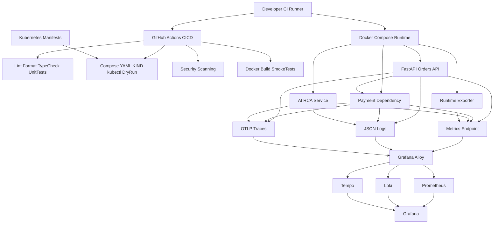

# OpsSight Observability Lab

[](https://github.com/capujm10/OpsSight-Observability-Lab/actions/workflows/ci.yml)
[](https://github.com/capujm10/OpsSight-Observability-Lab/actions/workflows/codeql.yml)
[](LICENSE)
[](pyproject.toml)
[](apps/api)
[](docker-compose.yml)
[](k8s)
[](observability/prometheus)
[](observability/grafana)
[](observability/alloy)

## Executive Summary

OpsSight Observability Lab is a public SRE and platform engineering portfolio project that models a production-readiness observability stack on a local workstation. It runs real FastAPI services, emits metrics/logs/traces, provisions Grafana dashboards and alerting rules, validates Kubernetes manifests, and enforces CI quality gates for Python, containers, infrastructure, and dependency security.

The project is intentionally local-first. It is built to demonstrate engineering judgment around service instrumentation, incident workflows, CI/CD quality control, and baseline security hardening without pretending that a Docker Compose lab is a fully managed production platform.

## Why This Project Exists

OpsSight exists to show the operational work behind a credible platform engineering portfolio project: designing service telemetry, validating runtime dependencies, failing builds for the right reasons, and documenting how an operator would investigate real failure modes. The goal is not to present a toy dashboard stack; it is to demonstrate how an SRE thinks about evidence, readiness, failure isolation, and safe publication.

## Production-Readiness Goals

- Keep local startup reproducible through Docker Compose.
- Ensure CI validates static quality, tests, infrastructure manifests, containers, security scans, and a full smoke path.
- Preserve deterministic AI RCA behavior when no LLM provider is available.
- Make telemetry useful for incident response, not just chart screenshots.
- Keep production claims realistic: Compose is a lab runtime, while Kubernetes manifests and Helm scaffolding are migration/readiness artifacts.

## What This Project Demonstrates

- FastAPI service design with health checks, standardized responses, request correlation, structured logging, and Prometheus metrics.
- Dependency simulation through a separate payment-gateway service with latency and failure controls.
- OpenTelemetry traces exported through Grafana Alloy and stored in Tempo.
- Loki log ingestion with trace/correlation IDs for incident investigation.
- Prometheus recording rules, burn-rate alerts, service health signals, and SLO-oriented dashboards.
- Grafana dashboards for SRE overview, API golden signals, incident investigation, Docker runtime, Kubernetes operations, workstation telemetry, and AI runtime monitoring.
- Local-first AI RCA workflows with deterministic `rule_based` fallback and optional Ollama/LM Studio/OpenAI-compatible providers.
- Docker Compose runtime with non-root custom service containers and local-demo security boundaries.
- Kubernetes and Helm-ready manifests for migration/readiness review.
- Split GitHub Actions quality gates: Ruff, mypy, pytest, YAML validation, Docker build, KIND-backed Kubernetes validation, smoke testing, pip-audit, and Trivy.
- CodeQL Python static analysis as a separate code-scanning workflow.
- Public repository governance through Dependabot, CODEOWNERS, issue/PR templates, SECURITY.md, CONTRIBUTING.md, secret scanning, push protection, and branch protection.

## Architecture



## What It Demonstrates

- FastAPI service with production-style middleware, health checks, standardized responses, and exception handling.
- A separate observable payment-gateway dependency service with metrics, logs, traces, and failure simulation.
- Prometheus metrics for request rate, duration, errors, active requests, endpoint throughput, status distribution, and dependency latency.
- Structured JSON logs with correlation IDs, trace IDs, severity, route, status code, and exception stack traces.
- OpenTelemetry traces exported to Grafana Alloy and stored in Tempo.
- Grafana dashboards for golden signals and incident investigation.
- Prometheus and Grafana alerting with severity, probable causes, and remediation guidance.
- SLO and error budget tracking for availability, latency compliance, and error rate.
- Burn-rate recording rules and fast/slow burn alerts.
- Reproducible incident scenarios for downtime, latency, 500s, dependency degradation, and partial service failure.
- Production-inspired incident management and postmortem generation from structured incident data.
- Local-first AI-assisted RCA with rule-based fallback, Ollama/LM Studio/OpenAI-compatible provider support, and postmortem enrichment.
- k6 smoke, spike, and sustained load profiles.
- Kubernetes manifests and Helm-ready packaging placeholders.
- GitHub Actions CI for linting, tests, Docker/Compose validation, smoke tests, YAML validation, and Kubernetes dry-run validation.

## Local Development Quickstart

Prerequisites:

- Docker Desktop with Compose
- Bash-compatible shell for scripts
- Python 3.12 for local quality checks
- Optional: `make`, `kubectl`, and `jq`

Clone and start:

```bash
git clone https://github.com/capujm10/OpsSight-Observability-Lab.git
cd OpsSight-Observability-Lab

docker compose build
docker compose up -d
bash scripts/smoke-test.sh
```

Stop and clean local volumes:

```bash
docker compose down -v --remove-orphans
```

Python quality checks:

```bash
python -m ruff check apps scripts tests
python -m ruff format --check apps scripts tests
python -m pytest tests
```

Service-scoped tests:

```bash
cd apps/api
python -m pytest

cd ../ai-rca
python -m pytest
```

The services intentionally use service-local packages named `app`; run service tests from each service directory to avoid mixed import contexts.

## Docker Compose Usage

Start the full stack:

```bash
docker compose up -d --build
```

Useful endpoints:

| Component | URL |
| --- | --- |
| API docs | `http://localhost:8000/docs` |
| Payment gateway readiness | `http://localhost:8081/health/ready` |
| AI RCA readiness | `http://localhost:8090/health/ready` |
| Grafana | `http://localhost:3000` |
| Prometheus | `http://localhost:9090` |
| Loki | `http://localhost:3100` |
| Tempo | `http://localhost:3200` |
| Alloy | `http://localhost:12345` |

Local Grafana default:

```text
username: admin
password: admin
```

Set `GF_SECURITY_ADMIN_USER` and `GF_SECURITY_ADMIN_PASSWORD` before exposing Grafana outside a trusted local workstation.

## Smoke Testing

Run:

```bash
bash scripts/smoke-test.sh
```

Override endpoints if needed:

```bash
BASE_URL=http://localhost:8000 \
DEPENDENCY_URL=http://localhost:8081 \
GRAFANA_URL=http://localhost:3000 \
PROM_URL=http://localhost:9090 \
LOKI_URL=http://localhost:3100 \
TEMPO_URL=http://localhost:3200 \
bash scripts/smoke-test.sh
```

## Kubernetes Validation

Kubernetes manifests live under:

- `k8s/base`
- `k8s/api`
- `k8s/monitoring`
- `k8s/overlays/local`

CI starts a KIND cluster and validates manifests with:

```bash
kubectl apply --dry-run=client --validate=false -f k8s/base -f k8s/api -f k8s/monitoring
```

Local validation example:

```bash
kubectl apply --dry-run=client --validate=false -f k8s/base -f k8s/api -f k8s/monitoring
```

Full deployment requires a Kubernetes cluster, image publishing strategy, ingress/TLS configuration, storage classes, and real secret management.

## Repository Structure

```text
apps/
  api/                     FastAPI orders service
  dependency/              Observable payment-gateway dependency
  ai-rca/                  AI-assisted RCA service with deterministic fallback
  local-runtime-exporter/  Docker/Ollama/host runtime metrics exporter
observability/
  alloy/                   Grafana Alloy collector config
  prometheus/              Prometheus scrape config, rules, and file SD
  grafana/                 Dashboards, datasources, and alerting provisioning
  loki/                    Loki config
  tempo/                   Tempo config
k8s/                       Kubernetes readiness manifests
helm/                      Helm packaging scaffold
load/k6/                   k6 load profiles
scripts/                   Smoke, simulation, RCA, and postmortem utilities
docs/                      Architecture, runbooks, security, AI RCA, and audit docs
incident-postmortems/      Templates, examples, and generated postmortems
.github/                   CI, Dependabot, ownership, and collaboration templates
```

## Screenshots

Screenshot placeholders are tracked under `docs/screenshots/`.

Recommended public portfolio screenshots:

- Grafana dashboards: SRE Overview, API Golden Signals, Incident Investigation, AI Runtime Monitoring.
- Prometheus: targets page and active alert/rule views.
- Tempo: dependency trace from an API request.
- Loki: structured logs filtered by `correlation_id` or `trace_id`.
- GitHub Actions: CI workflow showing split quality gates and CodeQL workflow.

No screenshot files are invented in this repository. Capture real images after `docker compose up -d --build`, load generation, and at least one incident scenario.

## Roadmap

- Add real dashboard screenshots after a full local run.
- Add SBOM generation and signed image provenance for release builds.
- Add production Helm values for external secrets, persistent storage, ingress TLS, and managed telemetry backends.
- Add authentication/authorization controls before exposing API or AI RCA endpoints beyond localhost.
- Add Grafana annotations from generated RCA milestones.
- Add release workflow for tagged container builds.
- Add dashboard screenshot regression checks after Grafana upgrades.

## Release Process

Releases follow semantic versioning and are recorded in [CHANGELOG.md](CHANGELOG.md).

1. Run local quality gates and smoke validation.
2. Confirm GitHub Actions CI and CodeQL pass on the release branch.
3. Update `CHANGELOG.md` with the release date, notable changes, security notes, and validation evidence.
4. Tag the release as `vMAJOR.MINOR.PATCH`.
5. Publish release notes that distinguish local-lab readiness from production deployment requirements.

## Interview Talking Points

- How the API propagates correlation IDs and trace IDs across logs, metrics, and traces.
- Why CI runs service tests in service directories instead of one mixed Python import context.
- How SLO burn-rate rules connect metrics to actionable incident response.
- Why Docker socket and host mounts are acceptable for a local observability lab but not production.
- How deterministic AI RCA fallback keeps incident analysis usable without an LLM provider.
- How split CI gates improve diagnosis compared with one long validation job.
- What would change when migrating from Compose to Kubernetes or managed telemetry backends.

## License and Contribution Notes

This repository is licensed under the [MIT License](LICENSE).

See [CONTRIBUTING.md](CONTRIBUTING.md) for local development and pull request expectations. Report suspected vulnerabilities through the process in [SECURITY.md](SECURITY.md).
