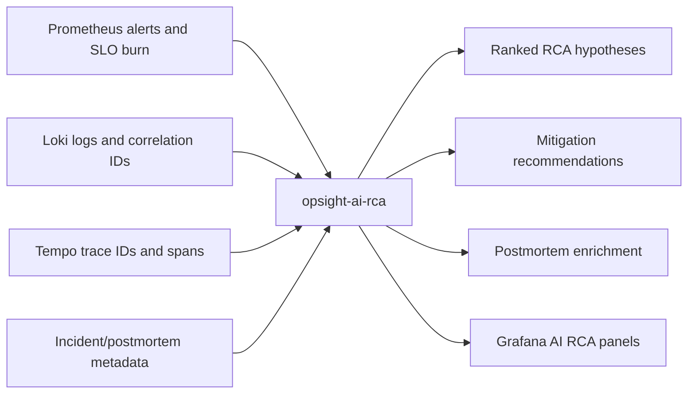

# OpsSight AI RCA

OpsSight AI RCA is a local-first operational intelligence layer for incident response. It analyzes alert metadata, SLO burn, metrics context, Loki log patterns, Tempo trace IDs, dependency signals, and postmortem metadata to produce concise RCA hypotheses and remediation guidance.

The service augments responders. It does not replace incident commander judgment, source telemetry, deployment history, or postmortem review.

## Architecture



## Provider Strategy

Default demo mode is deterministic:

```env
AI_PROVIDER=rule_based
```

Supported provider modes:

| Mode | Use Case | Notes |
| --- | --- | --- |
| `rule_based` | Reliable demos and CI | No API key, deterministic telemetry heuristics |
| `ollama` | Local private LLM | Uses Ollama HTTP API, default model `llama3.2` |
| `lmstudio` | Local OpenAI-compatible desktop runtime | Uses `/v1/chat/completions` |
| `openai_compatible` | Self-hosted or compatible inference endpoint | Configurable base URL and optional key |

The workflow never fails only because an LLM is unavailable. Provider failures are logged and counted in `opsight_ai_rca_provider_failures_total`, then the service falls back to rule-based RCA.

## Environment Variables

```env
AI_PROVIDER=ollama
AI_MODEL=llama3.2
AI_BASE_URL=http://host.docker.internal:11434
AI_API_KEY=
AI_TIMEOUT_SECONDS=30
AI_MAX_INPUT_CHARS=12000
AI_MAX_OUTPUT_TOKENS=800
```

For deterministic demos:

```env
AI_PROVIDER=rule_based
```

## Ollama Setup

Windows and macOS:

```powershell
ollama pull llama3.2
ollama serve
```

Compose service configuration:

```env
AI_PROVIDER=ollama
AI_BASE_URL=http://host.docker.internal:11434
AI_MODEL=llama3.2
```

Linux may require host gateway mapping if `host.docker.internal` is unavailable. Add this under the `ai-rca` service when needed:

```yaml
extra_hosts:
  - "host.docker.internal:host-gateway"
```

## LM Studio Setup

Enable the OpenAI-compatible local server in LM Studio and use:

```env
AI_PROVIDER=lmstudio
AI_BASE_URL=http://host.docker.internal:1234/v1
AI_MODEL=<loaded-local-model>
```

## Recommended Local Models

Small machines:

- `phi3`
- `gemma2:2b`
- `llama3.2:3b`

Medium machines:

- `mistral`
- `qwen2.5:7b`
- `llama3.1:8b`

Higher-end machines:

- `qwen2.5:14b`
- `llama3.1:8b` with larger context
- `mistral-nemo` if available

Smaller models may produce less detailed RCA summaries. The rule-based provider remains the reliability baseline for demos, CI, and environments where model quality or connectivity is uncertain.

## API Workflows

Analyze a full incident:

```bash
python scripts/sample-ai-rca.py
```

Main endpoints:

- `POST /api/v1/rca/analyze`
- `POST /api/v1/alerts/explain`
- `POST /api/v1/traces/summarize`
- `POST /api/v1/logs/summarize`
- `POST /api/v1/postmortems/enrich`
- `POST /api/v1/alertmanager/webhook`

## Alertmanager Webhook Ingestion

The webhook endpoint accepts Alertmanager-compatible payloads and processes each alert independently.

Parsed fields:

- `labels.alertname`
- `labels.service`
- `labels.severity`
- `labels.slo`
- `labels.trace_id`
- `labels.correlation_id`
- `annotations.summary`
- `annotations.description`
- `annotations.remediation`
- `status`
- `startsAt`
- `endsAt`
- `fingerprint`

For each alert, the service queries live telemetry:

- Prometheus SLO burn rate, error rate, p95 latency, dependency latency, and service health.
- Loki recent logs for service, severity, trace ID, and correlation ID.
- Tempo trace details when trace IDs are present.

Generated RCA artifacts are persisted as JSON and markdown in `AI_RCA_ARTIFACT_DIR`.

Default local artifact path:

```env
AI_RCA_ARTIFACT_DIR=artifacts/ai-rca
```

Container path:

```env
AI_RCA_ARTIFACT_DIR=/app/artifacts/ai-rca
```

Replay the included fixture against a running stack:

```bash
docker compose up -d --build
python scripts/send-alertmanager-webhook.py
```

Or with curl:

```bash
curl -sS \
  -H "Content-Type: application/json" \
  --data-binary @apps/ai-rca/tests/fixtures/alertmanager-slo-fast-burn.json \
  http://localhost:8090/api/v1/alertmanager/webhook | jq .
```

The response includes generated artifact paths and the RCA analysis. If Prometheus, Loki, or Tempo are unavailable, the webhook still completes with degraded telemetry context and the rule-based provider remains available.

Example Alertmanager receiver:

```yaml
receivers:
  - name: opsight-ai-rca
    webhook_configs:
      - url: http://opsight-ai-rca:8090/api/v1/alertmanager/webhook
        send_resolved: true
```

## Hallucination Controls

- Prompts require structured JSON output.
- Prompts instruct the model to use only supplied telemetry.
- Responses include confidence and validation steps.
- Rule-based fallback is deterministic.
- Generated postmortem sections are explicitly labeled as AI-assisted and require human validation.

## Observability

The AI RCA service emits:

- `opsight_ai_rca_requests_total`
- `opsight_ai_rca_duration_seconds`
- `opsight_ai_rca_inference_seconds`
- `opsight_ai_rca_provider_failures_total`
- `opsight_ai_rca_token_usage_total`
- JSON logs with provider, model, workflow, outcome, trace ID, and correlation ID
- OTLP traces through Grafana Alloy into Tempo

## Troubleshooting

If Ollama is not reachable from Docker:

1. Confirm Ollama is running on the host.
2. Use `AI_BASE_URL=http://host.docker.internal:11434`.
3. On Linux, add `extra_hosts` with `host-gateway`.
4. Switch to `AI_PROVIDER=rule_based` to keep the incident workflow available.

If LLM output is malformed:

1. Use a smaller prompt window with `AI_MAX_INPUT_CHARS`.
2. Lower model temperature in provider code if experimenting.
3. Use `rule_based` for deterministic postmortem demos.
