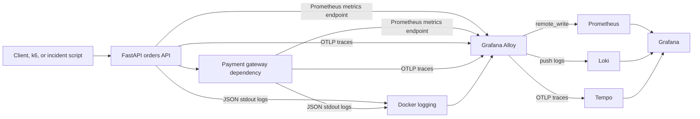

# Architecture

OpsSight Observability Lab is a local cloud-native observability ecosystem for a production-style FastAPI service.

The platform intentionally separates telemetry production from telemetry routing. The API and payment dependency emit structured logs, Prometheus metrics, and OTLP traces. Alloy acts as the local collector and routes each signal to the correct backend.

Ports:

- API: `http://localhost:8000`
- Payment gateway: `http://localhost:8081`
- Grafana: `http://localhost:3000`
- Prometheus: `http://localhost:9090`
- Loki: `http://localhost:3100`
- Tempo: `http://localhost:3200`
- Alloy: `http://localhost:12345`
