# Incident Management

OpsSight treats incident management as an operational system: alerts detect symptoms, dashboards scope impact, logs and traces explain causality, and postmortems turn response evidence into preventive engineering work.

## Severity Matrix

| Severity | Definition | Examples | Response Target | Command Model |
| --- | --- | --- | --- | --- |
| SEV-1 | Broad customer impact, outage, data-risk incident, or rapid SLO fast burn | API unavailable, fast-burn alert firing, widespread 5xx | Immediate | Incident commander, communications owner, technical lead |
| SEV-2 | Material partial degradation or dependency failure with customer impact | payment-gateway errors, elevated 503s, high p95 latency | 15 minutes | On-call owner with escalation path |
| SEV-3 | Limited impact, isolated workflow, or degraded non-critical path | single endpoint regression, localized latency | Same business day | Owning team triage |
| SEV-4 | No active customer impact; operational hygiene issue | noisy alert, missing dashboard, documentation gap | Planned | Backlog item |

## Escalation Model

1. On-call engineer acknowledges the alert and opens the Incident Investigation dashboard.
2. If impact is broad, burn-rate is high, or mitigation is unclear within 10 minutes, escalate to SEV-1 or SEV-2.
3. Assign roles for SEV-1: incident commander, technical lead, communications owner, scribe.
4. Keep mitigation separate from root-cause analysis. Stabilize first, explain second.
5. Escalate to dependency owner when Tempo traces show downstream span errors or latency.

## On-Call Workflow

1. Acknowledge alert.
2. Capture incident start time in UTC.
3. Open `OpsSight SRE Overview` and confirm availability, burn rate, active alerts, and dependency health.
4. Open `OpsSight Incident Investigation` and filter logs by severity and route.
5. Pivot from Loki `trace_id` or `trace_url` to Tempo.
6. Identify whether the failure is API-local, dependency-induced, or platform-level.
7. Apply the smallest mitigation that reduces customer impact.
8. Confirm recovery using metrics, logs, traces, and smoke tests.
9. Generate a postmortem draft from structured incident metadata.

## Investigation Workflow

Use the same path for every incident:

```mermaid
flowchart LR
  Alert[Alert fires] --> SLO[SLO and burn-rate scope]
  SLO --> Metrics[Prometheus RED metrics]
  Metrics --> Logs[Loki structured logs]
  Logs --> Trace[Tempo trace by trace_id]
  Trace --> Span[Dependency span timing]
  Span --> RCA[Root cause hypothesis]
  RCA --> Mitigation[Mitigation]
  Mitigation --> Validation[Recovery validation]
```



Minimum evidence to capture:

- Alert name and active timestamp.
- Impacted service and endpoint.
- Error rate or latency percentile.
- SLO burn-rate values.
- Loki query used.
- Tempo trace ID.
- Correlation ID.
- Recovery validation command.

## Mitigation Workflow

1. Stop or reduce the failing traffic pattern when possible.
2. Roll back the suspected release if impact correlates with deployment.
3. Isolate or bypass degraded dependencies when the business process allows it.
4. Restart only after confirming process health is the issue.
5. Keep customer-visible mitigation decisions explicit in the timeline.

## Recovery Validation

An incident is not resolved until all relevant checks are true:

- Primary alert is resolved or clearly trending below threshold.
- `up{job=~"opsight-api|payment-gateway"}` is healthy.
- Error rate has returned below threshold.
- p95 latency has returned below target.
- Loki no longer shows new error logs for the incident signature.
- Tempo traces show successful API and dependency spans.
- `bash scripts/smoke-test.sh` passes.
- Burn rate is decreasing after mitigation.

## Postmortem Philosophy

OpsSight postmortems are blameless and evidence-driven. The goal is to improve the system, not to assign personal fault. Every postmortem should connect customer impact, telemetry evidence, root cause, and concrete preventive actions.

Good postmortems:

- Use exact UTC timestamps.
- Separate detection, mitigation, resolution, and prevention.
- Include telemetry references that another engineer can replay.
- Identify contributing factors beyond the immediate trigger.
- Produce owned follow-up tasks.
- Avoid vague action items like "monitor better."

## Postmortem Generation

Structured incident examples live in `incident-postmortems/examples/`.

Templates live in `incident-postmortems/templates/`.

Generated reports are written to `incident-postmortems/generated/`.

Generate all reports:

```bash
python scripts/generate-postmortem.py
```

Generate one report:

```bash
python scripts/generate-postmortem.py --input incident-postmortems/examples/INC-2026-05-14-001-dependency-degradation.json
```

## Grafana Operational Annotations

Postmortem metadata includes annotation-ready events for:

- `incident_start`
- `mitigation_deployed`
- `recovery_confirmed`

Dashboards also include Loki-backed annotation queries for incident-stage log events. In production, the same events should be posted to the Grafana annotations API from the incident bot or postmortem generator.
