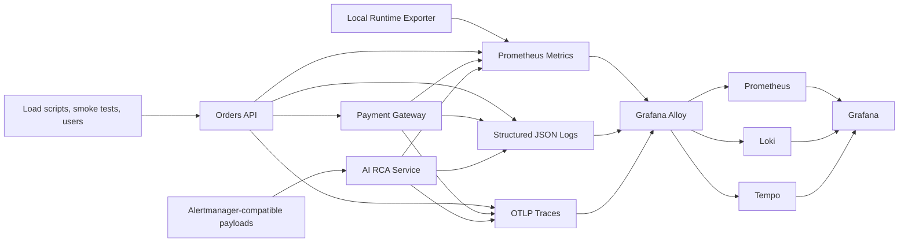
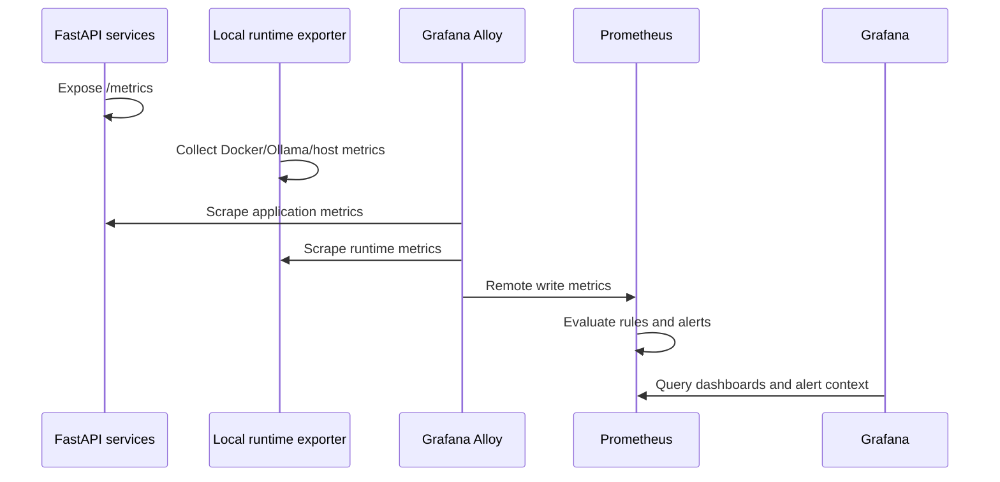
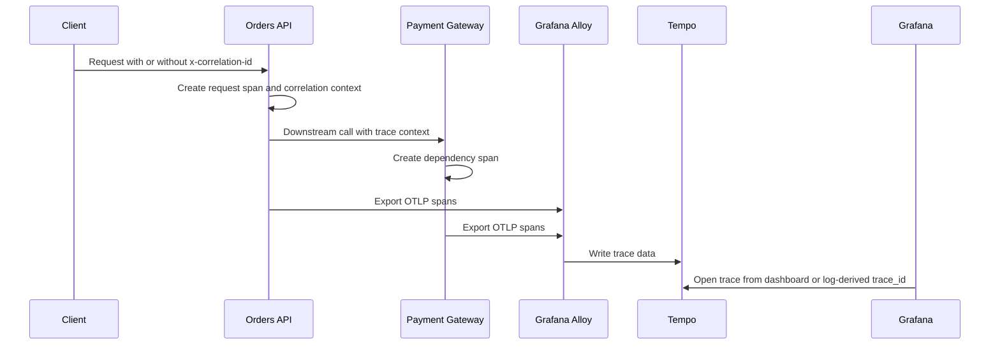
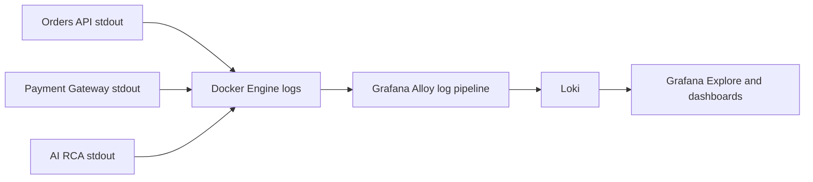
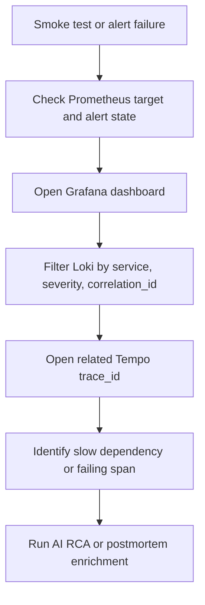
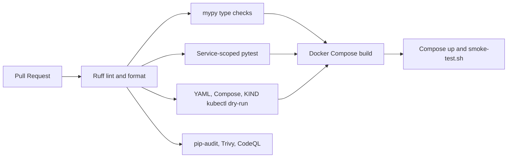

# Observability Architecture

This document describes how OpsSight moves telemetry from instrumented services into the local observability stack. The design is intentionally local-first, but the signal paths mirror patterns used in production SRE platforms: collect at service boundaries, centralize through a collector, store in fit-for-purpose backends, and investigate incidents through linked dashboards, logs, traces, and alerts.

## Runtime Topology

## Metrics Flow

Prometheus stores service request counts, duration histograms, dependency metrics, AI RCA provider metrics, runtime exporter signals, and SLO burn-rate recording rules. Grafana dashboards use those series for golden signals, SRE overview, incident investigation, Docker runtime, Kubernetes operations, workstation telemetry, and AI runtime panels.

## Tracing Flow

OpenTelemetry instrumentation is configured in the FastAPI services. Trace IDs are also surfaced in structured logs so operators can pivot from logs to Tempo traces during incident review.

## Log Aggregation Flow

Application logs are structured JSON and include correlation IDs, trace IDs, severity, HTTP method, route/path, status code, and latency fields where available. Loki is the investigation store for recent errors, request completion logs, and dependency failure patterns.

## Service-to-Service Investigation Path

The expected SRE workflow is to start with a service-level symptom, validate it through metrics, pivot into logs for precise failure context, inspect traces for dependency timing and status, and then use the AI RCA service or postmortem generator as an investigation aid.

## CI and Runtime Validation Flow

The pipeline separates static correctness, infrastructure validation, security scanning, image build, and runtime smoke testing. This keeps failure domains visible and prevents a working unit-test suite from hiding broken containers or invalid Kubernetes manifests.
