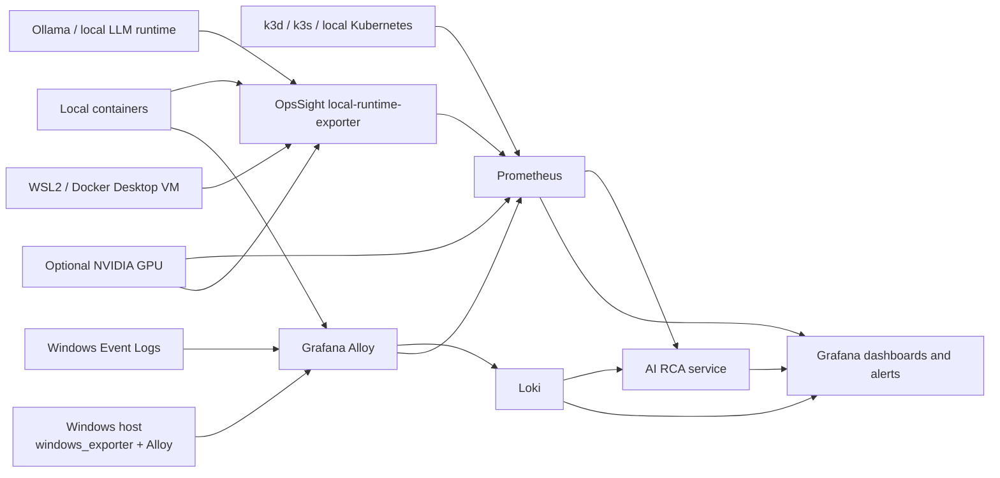

# OpsSight Workstation Observability

OpsSight now monitors the workstation and local infrastructure layer that runs the lab: Windows, WSL2, Docker Desktop, local containers, local Kubernetes, Ollama, and optional NVIDIA GPU telemetry.

## Architecture



## Telemetry Flow

- Windows metrics: `windows_exporter` or Windows Alloy `prometheus.exporter.windows`.
- Windows logs: Windows Alloy `loki.source.windowsevent` sends `Application` and `System` logs to Loki.
- Docker/container metrics: Alloy `prometheus.exporter.cadvisor` scrapes CPU, memory, filesystem, network, and cgroup metrics.
- Docker state: `local-runtime-exporter` reads the Docker API for health status and restart counts.
- WSL2 runtime: `local-runtime-exporter` reads Linux `/proc` memory/load data from the runtime where Docker Desktop runs.
- Kubernetes: Prometheus scrapes kube-state-metrics and metrics-server endpoints exposed from a local k3d/k3s cluster.
- Ollama: `local-runtime-exporter` checks `/api/tags` and exposes an instrumented `/ollama/api/generate` proxy for latency, failures, tokens, throughput, and model load duration.
- GPU: `local-runtime-exporter` uses `nvidia-smi` when available; the optional `dcgm-exporter` profile can be enabled on NVIDIA Container Toolkit hosts.

## Windows Exporter Setup

Install `windows_exporter` from the official prometheus-community project and enable the collectors OpsSight expects:

```powershell
msiexec /i windows_exporter-<version>-amd64.msi ENABLED_COLLECTORS="cpu,cs,logical_disk,memory,net,os,process,service,system,tcp"
```

Or run the OpsSight helper from an elevated PowerShell session:

```powershell
.\scripts\install-windows-observability.ps1
```

For a non-admin workstation demo, run the user-mode helper instead:

```powershell
.\scripts\start-windows-exporter-dev.ps1
```

The user-mode helper downloads the official `windows_exporter` executable into `.opsight-tools/`, starts it on port `9182`, updates `observability/prometheus/file_sd/targets.local.json`, and reloads Prometheus. Use the elevated installer for persistent service-based monitoring.

For non-admin Windows Event Log demo ingestion, run:

```powershell
.\scripts\start-windows-eventlog-forwarder.ps1 -Once
```

For continuous local forwarding, omit `-Once`. The service-based Alloy path remains the preferred persistent option.

Validate from Windows:

```powershell
Invoke-WebRequest http://localhost:9182/metrics | Select-Object -ExpandProperty StatusCode
```

Validate from Docker Desktop:

```powershell
docker run --rm curlimages/curl:8.10.1 http://host.docker.internal:9182/metrics
```

Prometheus uses file-based discovery for optional host targets. The helper writes the ignored machine-local file `observability/prometheus/file_sd/targets.local.json` with the `windows-exporter` target and reloads Prometheus. To enable other optional targets manually, copy the relevant entry from `observability/prometheus/file_sd/targets.example` into `targets.local.json`.

## Windows Alloy Setup

Use [observability/alloy/windows-host.alloy](/C:/Users/PERSONAL/Documents/GitHub/OpsSight-Observability-Lab/observability/alloy/windows-host.alloy) when you want Alloy to collect Windows metrics and Event Logs directly from the host.

Install Grafana Alloy on Windows, then replace the service config with:

```powershell
Copy-Item .\observability\alloy\windows-host.alloy "C:\Program Files\GrafanaLabs\Alloy\config.alloy" -Force
Restart-Service Alloy
```

Run the service as Administrator so it can read performance counters and Event Logs. The config sends metrics to `http://localhost:9090/api/v1/write` and logs to `http://localhost:3100/loki/api/v1/push`.

## Docker and WSL2 Setup

Start the lab:

```powershell
docker compose up -d --build
```

Alloy runs with the Docker socket and host mounts required by cAdvisor. On Docker Desktop for Windows, this observes the Linux VM/container runtime rather than native Windows kernel internals. Native Windows visibility comes from `windows_exporter` or host Alloy.

Key metrics:

- `container_cpu_usage_seconds_total`
- `container_memory_working_set_bytes`
- `container_network_receive_bytes_total`
- `container_fs_usage_bytes`
- `opsight_docker_container_restart_count`
- `opsight_docker_container_health`
- `opsight_wsl_memory_bytes`
- `opsight_wsl_load_average`

## Kubernetes Monitoring

Create a local monitoring namespace and install kube-state-metrics:

```powershell
kubectl create namespace monitoring
kubectl apply -f k8s/monitoring/kube-state-metrics.yaml
kubectl -n monitoring port-forward --address 0.0.0.0 svc/kube-state-metrics 18080:8080
```

Install metrics-server using your cluster method. For k3d and k3s, expose it locally if you want Prometheus outside the cluster to scrape it:

```powershell
kubectl -n kube-system port-forward svc/metrics-server 4443:443
```

OpsSight Prometheus uses file-based target discovery for optional local cluster endpoints. Add the kube-state-metrics entry from `observability/prometheus/file_sd/targets.example` into `observability/prometheus/file_sd/targets.local.json`, then reload Prometheus:

```powershell
Invoke-RestMethod -Method Post -Uri http://localhost:9090/-/reload
```

For a production-like cluster, prefer an in-cluster Prometheus or Alloy DaemonSet with service discovery.

Primary Kubernetes signals:

- `kube_pod_container_status_restarts_total`
- `kube_pod_container_status_waiting_reason{reason="CrashLoopBackOff"}`
- `kube_node_status_condition`
- `kube_pod_container_resource_requests`
- `kube_pod_info`

## Ollama Observability

The local runtime exporter uses `OLLAMA_BASE_URL`, defaulting to `http://host.docker.internal:11434`.

Inventory-only metrics work when Ollama is running:

- `opsight_ollama_up`
- `opsight_ollama_active_models`

For request-level metrics, send local inference through the proxy:

```powershell
$body = @{ model = "llama3.2"; prompt = "Summarize workstation observability."; stream = $false } | ConvertTo-Json
Invoke-RestMethod -Method Post -Uri http://localhost:9108/ollama/api/generate -ContentType application/json -Body $body
```

Request metrics:

- `opsight_ollama_request_duration_seconds`
- `opsight_ollama_requests_total`
- `opsight_ollama_failures_total`
- `opsight_ollama_tokens_total`
- `opsight_ollama_tokens_per_second`
- `opsight_ollama_model_load_seconds`

## GPU Monitoring

The default exporter attempts `nvidia-smi`. If unavailable, `opsight_gpu_telemetry_available` is `0` and GPU panels degrade without breaking the stack.

For hosts with NVIDIA Container Toolkit:

```powershell
docker compose --profile gpu up -d dcgm-exporter
```

Then add the `dcgm-exporter:9400` entry from `observability/prometheus/file_sd/targets.example` into `targets.local.json` and reload Prometheus. The default `local-runtime-exporter` GPU path remains active even when DCGM is not enabled.

GPU signals:

- `opsight_gpu_utilization_percent`
- `opsight_gpu_memory_bytes`
- `opsight_gpu_temperature_celsius`
- `opsight_gpu_power_watts`
- `DCGM_FI_DEV_GPU_UTIL`
- `DCGM_FI_DEV_FB_USED`

## Dashboards

- OpsSight Workstation Operations: Windows CPU, per-core CPU, memory, pagefile, disk, network, TCP, services, WSL2, Event Logs.
- OpsSight Docker Runtime: container CPU, memory, network, filesystem growth, health, restarts, states.
- OpsSight Kubernetes Operations: kube-state-metrics health, pod restarts, CrashLoopBackOff, node pressure, namespace pressure, API server, ingress.
- OpsSight AI Runtime Monitoring: Ollama latency, token throughput, failures, active models, model load time, GPU utilization, VRAM pressure, CPU fallback indicators.

## Alerts

Prometheus rules include:

- `OpsSightWindowsExporterDown`
- `OpsSightWindowsCpuSaturation`
- `OpsSightWindowsDiskPressure`
- `OpsSightWindowsServiceFailure`
- `OpsSightDockerContainerUnhealthy`
- `OpsSightDockerContainerRestarting`
- `OpsSightContainerMemoryPressure`
- `OpsSightWslMemoryPressure`
- `OpsSightOllamaUnavailable`
- `OpsSightOllamaLatencySpike`
- `OpsSightGpuVramPressure`
- `OpsSightKubernetesPodRestarting`
- `OpsSightKubernetesCrashLoopBackOff`

## Incident Scenarios

Run scenarios from PowerShell:

```powershell
.\scripts\simulate-local-incident.ps1 -Scenario container-crashloop
.\scripts\simulate-local-incident.ps1 -Scenario docker-memory
.\scripts\simulate-local-incident.ps1 -Scenario ollama-latency
.\scripts\simulate-local-incident.ps1 -Scenario wsl-cpu
.\scripts\simulate-local-incident.ps1 -Scenario disk-pressure
.\scripts\simulate-local-incident.ps1 -Scenario gpu-saturation
```

Each scenario creates local evidence where practical, sends an Alertmanager-compatible webhook to AI RCA, and writes RCA artifacts under `artifacts/ai-rca/`.

## Troubleshooting

- Windows panels empty: verify `windows_exporter` on `localhost:9182`, verify `observability/prometheus/file_sd/targets.local.json` contains the Windows target, then verify Docker can reach `host.docker.internal:9182`.
- Event Logs missing: confirm Windows Alloy is installed, running as Administrator, and using `windows-host.alloy`; for non-admin demo mode, run `.\scripts\start-windows-eventlog-forwarder.ps1 -Once`.
- cAdvisor empty: confirm Alloy is running with privileged mode and Docker socket/host mounts.
- Docker health empty: confirm `local-runtime-exporter` can read `/var/run/docker.sock`.
- Kubernetes panels empty: confirm port-forwards for kube-state-metrics and metrics-server are active and that the file discovery targets are enabled.
- Ollama unavailable: start Ollama and confirm `http://host.docker.internal:11434/api/tags` from the OpsSight network.
- GPU panels empty: install NVIDIA drivers and `nvidia-smi`; use the `gpu` profile only when NVIDIA Container Toolkit is configured.
